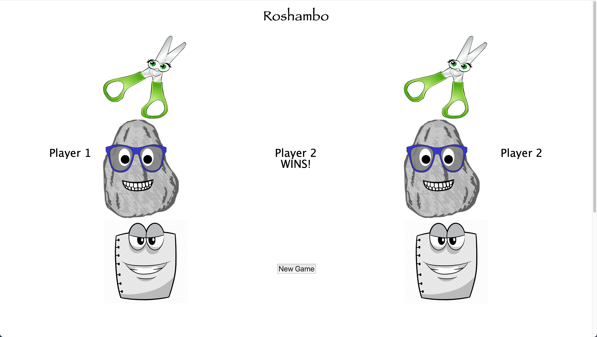

# New Roshambo Js 

This app uses a minesweeper [API](https://minesweeper-api.herokuapp.com/) to communicate with a back-end API server to create the user-interface for a Minesweeper clone. It might help to familiarize yourself with the game if you have never played it.
https://en.wikipedia.org/wiki/Rock_paper_scissors

Objectives:

- Understand how state drives changes to an interface in React
- Use React lifecycle methods
- Understand and interpret API documentation

Technologies:

- JavaScript
- React
